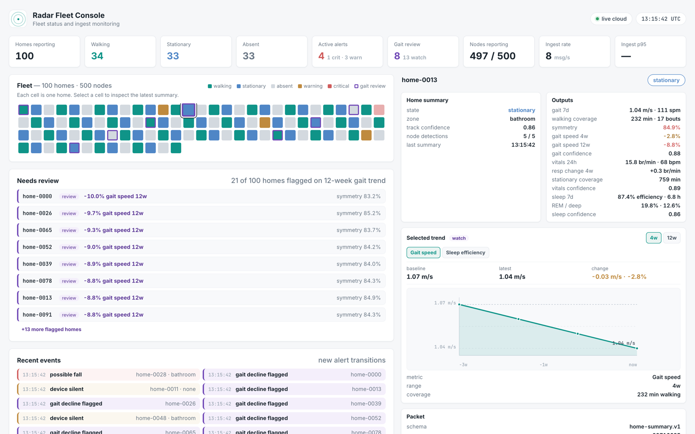
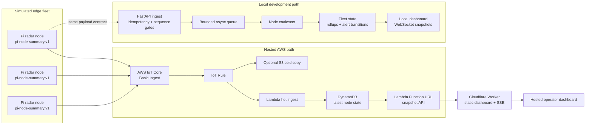

# Radar Care Fleet Demo

A hosted software prototype for monitoring a synthetic fleet of in-home
biomedical radar nodes.

The demo focuses on the software layer around an edge-to-cloud sensing system:
telemetry contracts, authenticated ingest, idempotent stream handling,
backpressure, node-to-home aggregation, cloud deployment, cost control, and an
operator dashboard for fleet triage.

Live dashboard:
[radar-care-fleet-demo.jahangiri-arya.workers.dev](https://radar-care-fleet-demo.jahangiri-arya.workers.dev/)

Deep link to a flagged home:
[`/?home=home-0013`](https://radar-care-fleet-demo.jahangiri-arya.workers.dev/?home=home-0013)

[](https://radar-care-fleet-demo.jahangiri-arya.workers.dev/)

## Scope

This is a software and cloud-ingestion demo, not a clinical product or a radar
DSP implementation. The fleet, device telemetry, gait, vitals, sleep, and alert
states are synthetic. The radar framing is grounded in published biomedical
radar monitoring work, with implementation boundaries kept explicit throughout
the public documentation.

The public demo runs without a laptop in the live path. Cloudflare serves the
dashboard and streams synthetic latest-state snapshots backed by the hosted AWS
path.

## System Facts

| Area | Implementation |
| --- | --- |
| Fleet model | 100 simulated homes and 500 Raspberry Pi-like radar nodes |
| Edge payload | `pi-node-summary.v1`, a reduced telemetry summary per node |
| Home payload | `home-summary.v1`, coalesced from latest node state |
| Local runtime | FastAPI ingest, bounded async queue, WebSocket dashboard snapshots |
| Hosted runtime | AWS IoT Core Basic Ingest, Lambda, DynamoDB, Lambda Function URL, Cloudflare Worker, Server-Sent Events |
| Data posture | Synthetic summaries only. Raw range-Doppler frames never leave the simulated home |
| Infrastructure | Terraform for AWS resources and a Cloudflare Worker for the public dashboard |

## Architecture



The hosted path maps the same reduced telemetry contract onto cloud services.
The local path is a deterministic harness for development, testing, and
technical walkthroughs without cloud credentials.

## Engineering Evidence

- Signed local ingest: HMAC headers bind publisher identity to the node or site
  in the payload before state is accepted. See
  [`shared/device_auth.py`](shared/device_auth.py) and
  [`SECURITY_MODEL.md`](SECURITY_MODEL.md).
- Stream ordering: `node_id + boot_id + seq` forms the idempotency boundary for
  direct-node summaries. Stale or replayed packets do not move fleet state
  backwards.
- Backpressure: ingest uses a bounded async queue. When overloaded, the API
  returns a retryable `503` before committing idempotency state.
- Node-to-home coalescing: independent node reports are reduced into one stable
  home-level snapshot so the dashboard does not become a packet firehose.
- Fixed-rate fan-out: dashboard snapshots are broadcast at a fixed cadence, so
  operator traffic is decoupled from ingest rate.
- Visible reliability posture: the dashboard exposes throughput, queue depth,
  latency, duplicate drops, stale drops, node reporting status, alert counts, and
  warning or critical home counts.
- Hosted infrastructure: Terraform provisions the AWS ingest slice, and the
  Cloudflare Worker serves the public dashboard plus Server-Sent Events.

## Dashboard Coverage

- Fleet grid with activity state, alert severity, node reporting status, and
  gait-review flags across 100 homes.
- Triage queue for homes ranked by 12-week gait-speed decline, with step-time
  symmetry and trend buckets shown alongside the review status.
- Per-home drill-down for gait, vitals, sleep, confidence values, 4-week and
  12-week trends, node health, and raw packet contract inspection.
- Radar-grounded visual language: range gates, azimuth bearing, detected peaks,
  zero-Doppler band, and derived gait or vital-sign windows.
- Ingest-health panel showing whether the system is keeping up with simulated
  fleet traffic.

## Privacy And Clinical-Data Posture

- No real participants or patient data are used.
- Nodes publish reduced derived summaries, not raw radar frames.
- The public read path exposes latest synthetic snapshots only.
- Hosted write operations, credentials, raw frame data, and private operator
  data are not exposed by the dashboard.
- Production operator authentication, audit logging, tenant scoping, retention,
  and device certificate lifecycle management are documented as out of scope in
  [`SECURITY_MODEL.md`](SECURITY_MODEL.md).

## Run Locally

On macOS, Linux, or WSL:

```bash
scripts/setup.sh
scripts/run_local_demo.sh
```

On Windows PowerShell:

```powershell
powershell -ExecutionPolicy Bypass -File scripts/setup.ps1
powershell -ExecutionPolicy Bypass -File scripts/run_local_demo.ps1
```

Then open <http://127.0.0.1:8765/>.

Setup creates a local `.env` with `INGEST_AUTH_MODE=hmac` and a generated
`NODE_HMAC_SECRET`. The `.env` file is ignored by Git.

For manual commands, cloud comparison, or the legacy per-home gateway topology,
see [`ARCHITECTURE.md`](ARCHITECTURE.md).

## CI And Checks

```bash
python -m unittest discover -s tests
node --check app.js
node --check infra/cloudflare/worker.js
terraform -chdir=infra/aws fmt -check
npm run cloudflare:check
```

The test suite covers the ingest contract, HMAC auth boundary, queue-full retry
semantics, node coalescing, domain model, AWS topic mapping, Lambda simulators,
and dashboard copy guardrails.

GitHub Actions runs these checks on pull requests and pushes to `main`.

## Cloudflare Deployment

The same GitHub Actions workflow can deploy the public dashboard after checks
pass. Manual deployment is available from the Actions tab through
`workflow_dispatch`. Automatic deployment from `main` is disabled until the
repository variable `CLOUDFLARE_DEPLOY_ENABLED` is set to `true`.

Required GitHub secrets:

```text
CLOUDFLARE_API_TOKEN
CLOUDFLARE_ACCOUNT_ID
AWS_SNAPSHOT_URL
```

`AWS_SNAPSHOT_URL` should be the Lambda Function URL snapshot endpoint produced
by the AWS Terraform output `dashboard_snapshot_url`.

## Hosted Path And Cost

The AWS folder provisions a small, controlled ingest slice:

- AWS IoT Core Basic Ingest topics for reduced node summaries.
- Lambda hot ingest into DynamoDB latest-state records.
- Optional S3 cold copy, disabled by default.
- A Lambda Function URL that exposes synthetic latest-state snapshots.
- Short DynamoDB TTL and CloudWatch log retention for cost containment.

The main cost driver is request count, not storage. The checked-in defaults keep
the load generator and S3 cold copy off unless explicitly enabled. Details are
in [`COST_MODEL.md`](COST_MODEL.md), [`infra/aws/README.md`](infra/aws/README.md),
and [`infra/cloudflare/README.md`](infra/cloudflare/README.md).

Direct-node topics use:

```text
imperial-demo/sites/<site-id>/nodes/<node-id>/summary
```

## Project Layout

| Path | Purpose |
| --- | --- |
| [`backend/`](backend/) | FastAPI ingest, node coalescing, fleet rollups, WebSocket snapshots |
| [`domain/`](domain/) | Synthetic home, occupant, radar-node, gait, vitals, sleep, and alert model |
| [`edge_simulator/`](edge_simulator/) | Direct-node simulator plus optional AWS IoT publisher and bridge |
| [`shared/`](shared/) | Device-auth signing helpers shared by backend and simulators |
| [`infra/aws/`](infra/aws/) | Terraform and Lambda code for the hosted AWS path |
| [`infra/cloudflare/`](infra/cloudflare/) | Worker serving the public dashboard and Server-Sent Events |
| [`cloud/topic_contracts.json`](cloud/topic_contracts.json) | MQTT topic and payload contract sketch |
| [`index.html`](index.html), [`app.js`](app.js), [`styles.css`](styles.css) | Operator dashboard without a frontend build step |
| [`tests/`](tests/) | Contract, auth, backpressure, simulator, and UI-copy tests |

Further documentation:
[`ARCHITECTURE.md`](ARCHITECTURE.md),
[`SECURITY_MODEL.md`](SECURITY_MODEL.md),
[`COST_MODEL.md`](COST_MODEL.md).

## Boundaries

This repository demonstrates the IoT software layer around a radar-monitoring
fleet. It does not implement radar signal processing, clinical validation,
physical device provisioning, production certificate management, long-term
history, production privacy controls, or a complete access-control model.
